# Sơ đồ thực thể – quan hệ (ERD)

## Hệ thống quản lý nhà trọ (iTro)

Sơ đồ dưới đây mô tả các bảng (entity) và quan hệ giữa chúng, đối chiếu với source code JPA trong backend.

---

## 1. ERD tổng quan (Mermaid)

```mermaid
erDiagram
    users ||--o{ password_reset_tokens : "has"
    users ||--o| tenant : "account_of"
    users ||--o{ notifications : "receives"
    users ||--o{ system_logs : "actor"

    areas ||--o{ rooms : "contains"

    rooms ||--o{ contracts : "has"
    rooms ||--o{ meter_readings : "has"
    rooms ||--o{ invoices : "for"
    rooms ||--o{ support_requests : "about"

    tenants ||--o{ contracts : "has"
    tenants ||--o{ invoices : "billed"
    tenants ||--o{ support_requests : "creates"

    invoices ||--o{ payments : "has"
    invoices ||--o| payos_order : "linked"

    users {
        bigint id PK
        varchar username UK
        varchar password
        varchar fullName
        varchar phone
        varchar email
        enum role
        boolean active
    }

    password_reset_tokens {
        bigint id PK
        varchar token UK
        bigint user_id FK
        datetime expiry
    }

    area {
        bigint id PK
        varchar name
        varchar address
        varchar description
    }

    room {
        bigint id PK
        varchar code
        varchar floor
        enum status
        decimal currentPrice
        decimal areaSize
        bigint area_id FK
    }

    tenant {
        bigint id PK
        varchar fullName
        varchar phone
        varchar idNumber
        varchar address
        varchar email
        varchar portraitImagePath
        varchar idCardImagePath
        bigint user_id FK
    }

    contract {
        bigint id PK
        bigint room_id FK
        bigint tenant_id FK
        date startDate
        date endDate
        enum status
        decimal deposit
        decimal rent
        datetime createdAt
    }

    service_price {
        bigint id PK
        decimal roomPrice
        decimal electricityPrice
        decimal waterPrice
        date effectiveFrom
    }

    meter_reading {
        bigint id PK
        bigint room_id FK
        int month
        int year
        int oldElectric
        int newElectric
        int oldWater
        int newWater
        decimal electricityCost
        decimal waterCost
        decimal totalCost
        datetime createdAt
    }

    invoice {
        bigint id PK
        bigint room_id FK
        bigint tenant_id FK
        int month
        int year
        decimal roomCost
        decimal electricityCost
        decimal waterCost
        decimal total
        enum status
        datetime createdAt
        datetime lastReminderEmailAt
        int reminderEmailCount
        varchar lastReminderEmailMessage
        datetime lastReminderSmsAt
        int reminderSmsCount
        varchar lastReminderSmsMessage
    }

    payment {
        bigint id PK
        bigint invoice_id FK
        decimal amount
        datetime paidAt
        enum method
    }

    payos_order {
        bigint id PK
        bigint orderCode UK
        bigint invoiceId
        datetime createdAt
    }

    support_request {
        bigint id PK
        bigint tenant_id FK
        bigint room_id FK
        varchar title
        varchar description
        enum status
        datetime createdAt
        datetime updatedAt
    }

    notification {
        bigint id PK
        bigint user_id FK
        varchar message
        boolean readFlag
        datetime sentAt
    }

    system_log {
        bigint id PK
        bigint actor_id FK
        varchar action
        varchar entityType
        varchar entityId
        varchar detail
        datetime createdAt
    }
```



---

## 2. Quan hệ chi tiết

| Thực thể 1  | Quan hệ | Thực thể 2                | Mô tả                                                        |
| ----------- | ------- | ------------------------- | ------------------------------------------------------------ |
| **users**   | 1 – N   | **password_reset_tokens** | Một user có nhiều token quên mật khẩu (theo thời gian).      |
| **users**   | 1 – 1   | **tenant**                | Một user (role Tenant) có tối đa một hồ sơ khách thuê.       |
| **users**   | 1 – N   | **notifications**         | Một user nhận nhiều thông báo.                               |
| **users**   | 1 – N   | **system_logs**           | Một user (actor) thực hiện nhiều thao tác ghi log.           |
| **area**    | 1 – N   | **room**                  | Một khu vực có nhiều phòng.                                  |
| **room**    | 1 – N   | **contract**              | Một phòng có nhiều hợp đồng (theo thời gian).                |
| **tenant**  | 1 – N   | **contract**              | Một khách thuê có nhiều hợp đồng.                            |
| **room**    | 1 – N   | **meter_reading**         | Một phòng có nhiều kỳ ghi chỉ số điện nước.                  |
| **room**    | 1 – N   | **invoice**               | Một phòng có nhiều hóa đơn (theo tháng/năm).                 |
| **tenant**  | 1 – N   | **invoice**               | Một khách thuê có nhiều hóa đơn.                             |
| **invoice** | 1 – N   | **payment**               | Một hóa đơn có nhiều lần thanh toán.                         |
| **invoice** | 1 – 1\* | **payos_order**           | Một hóa đơn có tối đa một đơn PayOS (logical FK: invoiceId). |
| **tenant**  | 1 – N   | **support_request**       | Một khách thuê tạo nhiều yêu cầu hỗ trợ.                     |
| **room**    | 1 – N   | **support_request**       | Một phòng có thể liên quan nhiều yêu cầu hỗ trợ.             |

\* payos_order lưu `invoiceId` (Long), không dùng @ManyToOne trong entity.

---

## 3. Các bảng (table name trong DB)

| Entity (Java)      | Bảng MySQL            |
| ------------------ | --------------------- |
| User               | users                 |
| PasswordResetToken | password_reset_tokens |
| Area               | area                  |
| Room               | room                  |
| Tenant             | tenant                |
| Contract           | contract              |
| ServicePrice       | service_price         |
| MeterReading       | meter_reading         |
| Invoice            | invoice               |
| Payment            | payment               |
| PayOSOrder         | payos_order           |
| SupportRequest     | support_request       |
| Notification       | notification          |
| SystemLog          | system_log            |

---

## 4. Enum (lưu dạng STRING trong DB)

| Enum           | Các giá trị                            |
| -------------- | -------------------------------------- |
| Role           | ADMIN, STAFF, TENANT                   |
| RoomStatus     | AVAILABLE, RENTED, MAINTENANCE, …      |
| ContractStatus | ACTIVE, EXPIRED, TERMINATED, …         |
| InvoiceStatus  | UNPAID, PAID, PARTIAL, OVERDUE, …      |
| SupportStatus  | OPEN, IN_PROGRESS, RESOLVED, CLOSED, … |
| PaymentMethod  | CASH, BANK_TRANSFER, PAYOS, …          |

---

## 5. Sơ đồ rút gọn (chỉ quan hệ)

```mermaid
erDiagram
    users ||--o{ password_reset_tokens : ""
    users ||--o| tenant : ""
    users ||--o{ notifications : ""
    users ||--o{ system_logs : ""

    area ||--o{ room : ""
    room ||--o{ contract : ""
    tenant ||--o{ contract : ""
    room ||--o{ meter_reading : ""
    room ||--o{ invoice : ""
    tenant ||--o{ invoice : ""
    invoice ||--o{ payment : ""
    invoice ||--o| payos_order : "invoiceId"
    tenant ||--o{ support_request : ""
    room ||--o{ support_request : ""

    service_price : "standalone"
```

_Bảng `service_price` không có khóa ngoại; dùng theo thời gian (effectiveFrom) để áp giá._

---

_ERD được sinh từ domain entity trong `backend/src/main/java/com/motelmanagement/domain/`._
