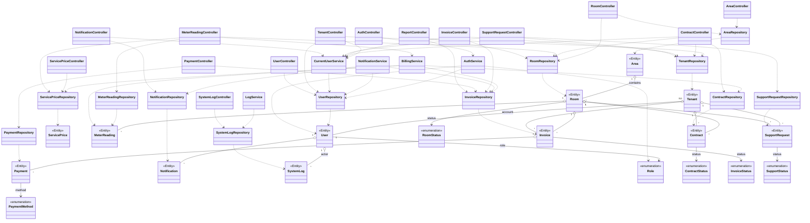

## 2.2.4. So do Class muc 1 (tu source code hien tai)

```mermaid
classDiagram
%% ======================
%% Domain entities
%% ======================
class Area
class Room
class Tenant
class Contract
class ServicePrice
class MeterReading
class Invoice
class Payment
class SupportRequest
class Notification
class SystemLog
class User

<<Entity>> Area
<<Entity>> Room
<<Entity>> Tenant
<<Entity>> Contract
<<Entity>> ServicePrice
<<Entity>> MeterReading
<<Entity>> Invoice
<<Entity>> Payment
<<Entity>> SupportRequest
<<Entity>> Notification
<<Entity>> SystemLog
<<Entity>> User

class Role
class RoomStatus
class ContractStatus
class InvoiceStatus
class SupportStatus
class PaymentMethod

<<enumeration>> Role
<<enumeration>> RoomStatus
<<enumeration>> ContractStatus
<<enumeration>> InvoiceStatus
<<enumeration>> SupportStatus
<<enumeration>> PaymentMethod

Area "1" o-- "*" Room : contains
Room "1" o-- "*" Contract
Tenant "1" o-- "*" Contract
Tenant "0..1" -- "1" User : account
Room "1" o-- "*" Invoice
Tenant "1" o-- "*" Invoice
Invoice "1" o-- "*" Payment
Room "1" o-- "*" MeterReading
Tenant "1" o-- "*" SupportRequest
Room "1" o-- "*" SupportRequest
User "1" o-- "*" Notification
User "1" o-- "*" SystemLog : actor

User --> Role : role
Room --> RoomStatus : status
Contract --> ContractStatus : status
Invoice --> InvoiceStatus : status
SupportRequest --> SupportStatus : status
Payment --> PaymentMethod : method

%% ======================
%% Repositories
%% ======================
class AreaRepository
class RoomRepository
class TenantRepository
class ContractRepository
class ServicePriceRepository
class MeterReadingRepository
class InvoiceRepository
class PaymentRepository
class SupportRequestRepository
class NotificationRepository
class SystemLogRepository
class UserRepository

AreaRepository ..> Area
RoomRepository ..> Room
TenantRepository ..> Tenant
ContractRepository ..> Contract
ServicePriceRepository ..> ServicePrice
MeterReadingRepository ..> MeterReading
InvoiceRepository ..> Invoice
PaymentRepository ..> Payment
SupportRequestRepository ..> SupportRequest
NotificationRepository ..> Notification
SystemLogRepository ..> SystemLog
UserRepository ..> User

%% ======================
%% Services
%% ======================
class AuthService
class BillingService
class NotificationService
class LogService
class CurrentUserService

AuthService ..> UserRepository
AuthService ..> User
AuthService ..> Role
BillingService ..> InvoiceRepository
BillingService ..> ServicePriceRepository
BillingService ..> ContractRepository
BillingService ..> MeterReading
NotificationService ..> InvoiceRepository
NotificationService ..> NotificationRepository
NotificationService ..> UserRepository
LogService ..> SystemLogRepository
CurrentUserService ..> UserRepository

%% ======================
%% Controllers
%% ======================
class AuthController
class AreaController
class RoomController
class TenantController
class ContractController
class ServicePriceController
class MeterReadingController
class InvoiceController
class PaymentController
class UserController
class SupportRequestController
class ReportController
class NotificationController
class SystemLogController

AuthController ..> AuthService
AreaController ..> AreaRepository
RoomController ..> RoomRepository
RoomController ..> AreaRepository
TenantController ..> TenantRepository
TenantController ..> UserRepository
TenantController ..> CurrentUserService
ContractController ..> ContractRepository
ContractController ..> RoomRepository
ContractController ..> TenantRepository
ContractController ..> CurrentUserService
ServicePriceController ..> ServicePriceRepository
MeterReadingController ..> MeterReadingRepository
MeterReadingController ..> RoomRepository
MeterReadingController ..> ServicePriceRepository
MeterReadingController ..> BillingService
InvoiceController ..> InvoiceRepository
InvoiceController ..> TenantRepository
InvoiceController ..> CurrentUserService
PaymentController ..> PaymentRepository
PaymentController ..> InvoiceRepository
UserController ..> UserRepository
SupportRequestController ..> SupportRequestRepository
SupportRequestController ..> TenantRepository
SupportRequestController ..> CurrentUserService
ReportController ..> InvoiceRepository
ReportController ..> RoomRepository
NotificationController ..> NotificationRepository
NotificationController ..> CurrentUserService
SystemLogController ..> SystemLogRepository
```
